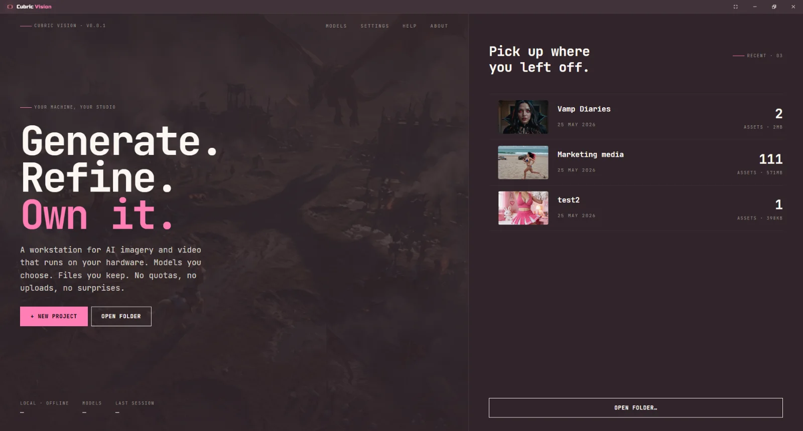
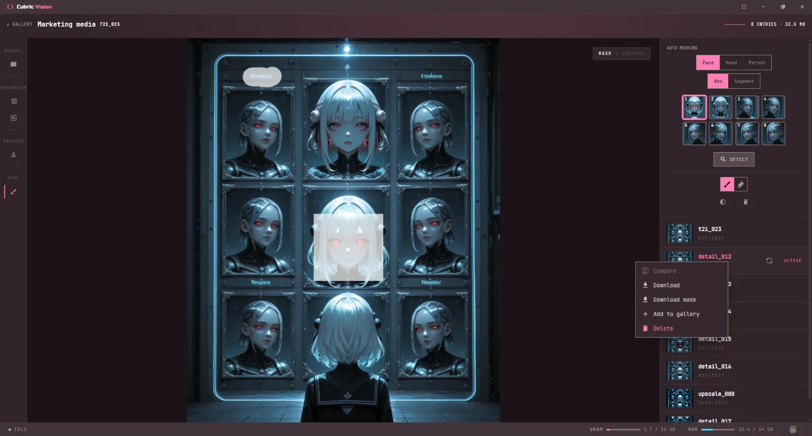
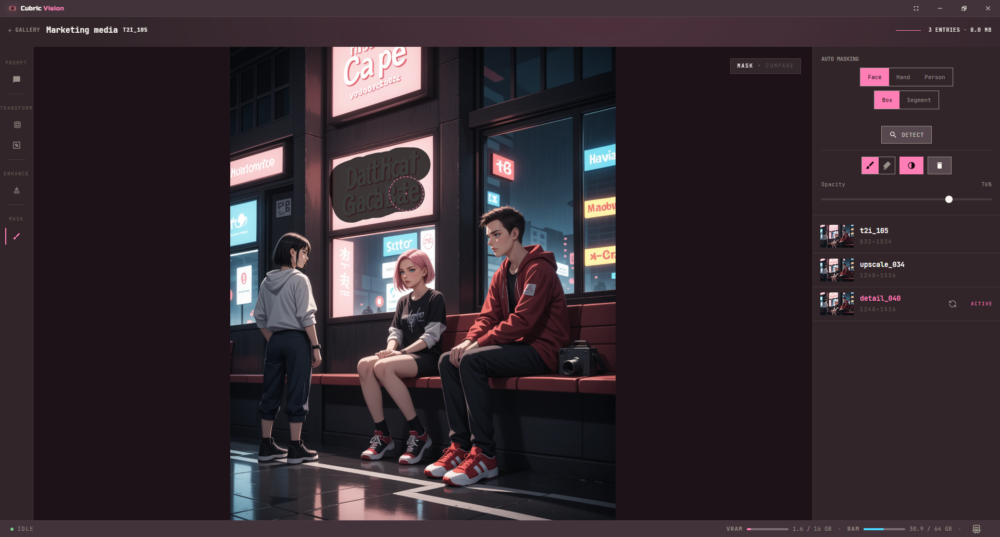
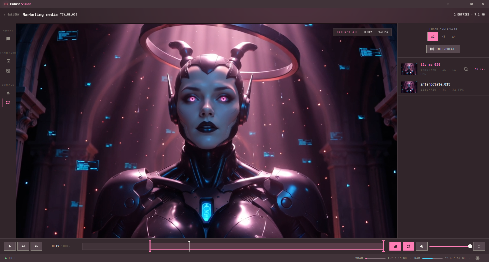
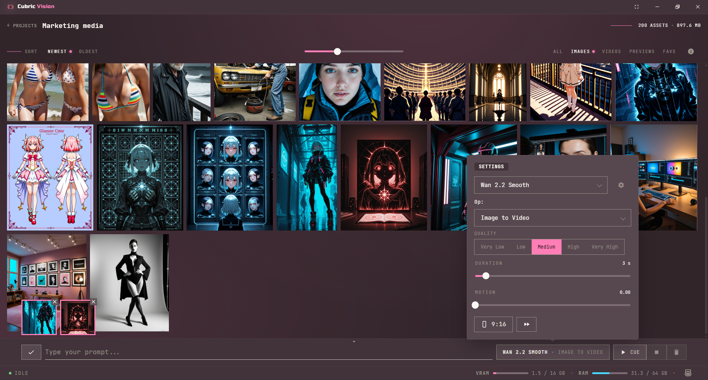

# Cubric Vision

**Local AI image and video generation, in a desktop app made for artists.**

[Website](https://cubric.studio/vision/) · [Documentation](https://docs.cubric.studio) · [Download](https://github.com/MadPonyInteractive/Cubric-Vision/releases/latest) · [Discord](https://discord.gg/WX7tDFSVmY) · [Roadmap](https://trello.com/b/wg1r5aYz/cubric-vision) · [Patreon](https://www.patreon.com/madponyinteractive)

---

Cubric Vision is a desktop workspace for generating images and video on your
own machine. It runs ComfyUI as its engine — curated models, tuned workflows,
no node graphs to wire up. You type a prompt, pick a model, and refine the
result with masking, detailing, upscaling, and video tools. Everything stays
local: your prompts, your images, your videos, your files.

Free, open source, and made by [Mad Pony Interactive](https://madponyinteractive.com).
No accounts. No API fees. No cloud.

## What it does

- **Image generation** — curated lineup of local models (SDXL, Illustrious,
  Pony-style, Flux, and more), with workflows tuned to give strong results
  without parameter fiddling.
- **Video generation** — text-to-video and image-to-video in stages: preview
  first, then take the shot further only when it's worth the render time.
- **Masking and detailing** — brush masks or auto-detect, inpaint any region,
  refine faces and details, export masks.
- **Upscaling** — model-based upscalers for images and video, plus custom
  upscaler support.
- **Video tools** — interpolate, resize, crop, upscale, and combine clips
  without leaving the app.
- **Projects and history** — every generation lands in a project with full
  history. Compare results side by side, branch from any earlier image, and
  find everything again in the gallery.
- **LoRAs and custom models** — point the app at your own LoRA and upscaler
  folders alongside the curated lineup.
- **One-click setup** — the app installs its own ComfyUI engine and downloads
  models for you. After install, no internet needed for local generation.

<table>
  <tr>
    <td></td>
    <td></td>
  </tr>
  <tr>
    <td></td>
    <td></td>
  </tr>
</table>

## Video generation

Text-to-video and image-to-video using Wan 2.2 — runs locally, staged previews
so you spend compute only on shots worth finishing.

https://github.com/user-attachments/assets/3a6277ab-554a-4d94-9af7-59c4451ec810

## Download and install

Grab the portable build for your platform from
[**GitHub Releases**](https://github.com/MadPonyInteractive/Cubric-Vision/releases/latest)
— no installer, just extract and launch. On first run the app sets up its
ComfyUI engine and asks where to store models.

Step-by-step instructions, including the macOS quarantine note, are in the
[installation guide](https://docs.cubric.studio/vision/installation/).

Patrons on [Patreon](https://www.patreon.com/madponyinteractive) get new builds
first — Patreon gates timing, not ownership. Every build reaches the public
release channel.

### What you'll need

| Workflow | GPU VRAM | System RAM |
| --- | --- | --- |
| Images (SDXL / Illustrious / Pony-style) | 8 GB+ | 16–32 GB |
| Images (Flux and newer) | 12 GB+ | 32 GB+ |
| Video | 12–16 GB | 32–64 GB |

## Documentation

The full user guide lives at [docs.cubric.studio](https://docs.cubric.studio):
[getting started](https://docs.cubric.studio/vision/getting-started/),
[projects](https://docs.cubric.studio/vision/projects/),
[prompt box](https://docs.cubric.studio/vision/prompt-box/),
[image tools](https://docs.cubric.studio/vision/image-tools/),
[video tools](https://docs.cubric.studio/vision/video-tools/),
[models](https://docs.cubric.studio/vision/models/),
[gallery](https://docs.cubric.studio/vision/gallery/),
[history](https://docs.cubric.studio/vision/history/), and
[hotkeys](https://docs.cubric.studio/vision/hotkeys/).

## Community and support

- [**Discord**](https://discord.gg/WX7tDFSVmY) — questions, feedback, and
  build announcements.
- [**GitHub Issues**](https://github.com/MadPonyInteractive/Cubric-Vision/issues)
  — bug reports.
- [**GitHub Discussions**](https://github.com/MadPonyInteractive/Cubric-Vision/discussions)
  — feature requests.
- [**Patreon**](https://www.patreon.com/madponyinteractive) — early-access
  builds, tutorial project files, and a direct line to the developer. Patreon
  funds the build.

Vision is the first app in the [Cubric Studio](https://cubric.studio) family.
Audio and Prompt are planned siblings — all local, all open source.

## For developers

Want to run from source or contribute? Start with
[docs/DEVELOPMENT.md](docs/DEVELOPMENT.md), then read
[CONTRIBUTING.md](CONTRIBUTING.md) before opening a PR. For
security-sensitive reports, see [SECURITY.md](SECURITY.md).

## License

Cubric Vision is licensed under [AGPL-3.0-only](LICENSE). Portable builds ship
with readable app source — open source isn't a marketing line here, it's how
the app is distributed.
