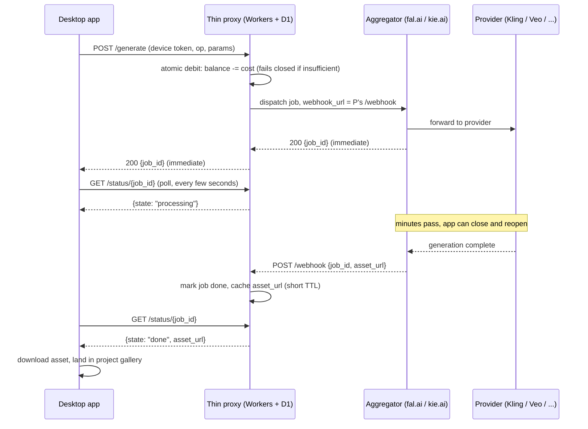

# Proprietary Models: Architecture and Billing Infrastructure

> Scope: the server-side architecture and billing plumbing needed to sell Kling, Seedance,
> MiniMax Hailuo, Nano Banana, Veo and Sora as paid credit-based options inside Cubric
> Vision, alongside the existing free local-ComfyUI and BYO-RunPod paths. Written cold,
> 2026-09-11. Read `docs/runpod-remote-engine.md` first if you need the existing
> RunPod-Pod architecture this proposal sits next to (it is not a proprietary-model
> aggregator, see §6).
>
> Labeling: a claim with a `[Source](url)` next to it came from a live search done for
> this doc. A claim marked **(reasoning)** is architectural judgment, not a fetched fact.
> A claim marked **UNVERIFIED** is a number this doc could not pin down live and should
> not be trusted without a follow-up check (the follow-up is named inline).

## 0. The one-paragraph answer

Do not build a full backend for v1. Build a thin, stateless metering proxy (Cloudflare
Workers + D1) that holds the provider key, checks and debits a credit balance, and
forwards the request to a model-API aggregator (fal.ai or kie.ai) that already exposes
Kling, Seedance, Hailuo, Veo and Nano Banana behind one key (Sora's status is unusual,
see §6.4). Sell credits through Paddle or Lemon Squeezy, both merchants of record, so a
UK solo developer never registers for VAT in 27 EU states plus every US sales-tax
state. Land the finished asset by webhook back into the proxy; the desktop app polls the
proxy, not the provider. This is the minimum viable shape that satisfies "credits, paid,
metered" without inventing a queue, an accounts system, or asset storage the app does not
already have a reason to own.

---

## 1. Do we need our own server at all?

Three shapes, compared on the same axis: cost to run, what breaks first, what it buys.

### (a) BYO key - user pastes their own provider key

**Cost to run:** $0 at any user count. There is no server.

**What breaks first (reasoning):** not infrastructure, the business model. This path
cannot bill credits, cannot take a margin, and cannot be the "paid options bought with
credits" the proposal asks for - it is a different product (bring-your-own-everything,
same shape as the existing BYO-RunPod path). It also breaks UX for the target user:
Cubric Vision's audience is creators, not developers; asking them to create six separate
developer accounts (Kling, ByteDance/Volcengine, MiniMax, Google AI, OpenAI) and manage
six keys is the same friction the RunPod BYO path already imposes on power users only,
scaled to the mainstream credit-buying user this proposal targets.

**What it buys:** zero maintenance, zero PCI/payment surface, zero margin. It is the
correct fallback for power users who already have provider accounts, not a substitute
for a credit system.

### (b) Thin proxy - stateless service holding the key, metering credits

**What it is (reasoning):** one HTTP surface that (1) authenticates the desktop app's
user, (2) atomically debits a credit balance, (3) forwards the generation request to the
upstream provider or aggregator with a server-held key, (4) records the job, (5) receives
the completion (webhook or poll-and-relay), (6) refunds credits on provider failure. No
accounts UI beyond "who is this," no asset storage beyond a short-lived cache, no queue
beyond what the provider's own async job model already gives for free.

**Cost to run (reasoning, built on the sourced unit prices in §3):**

| Users (monthly active) | Estimated fixed infra cost | Dominant cost line |
|---|---|---|
| 100 | ~$5-10/mo | Workers Paid plan base fee ($5/mo minimum) |
| 1,000 | ~$10-25/mo | Still mostly the base fee; request/CPU volume stays inside included allowances |
| 10,000 | ~$50-150/mo | D1 read/write volume and Workers request overage past included allowances |

These are Cloudflare-Workers-shaped estimates using the pricing in §3
([Cloudflare Workers pricing](https://developers.cloudflare.com/workers/platform/pricing/),
accessed 2026-09-11) and assume the proxy is I/O-bound (waiting on a slow upstream video
API), which is the case Cloudflare bills cheapest because CPU time excludes fetch-wait
time. The number that is NOT in this table and dominates the real bill: the pass-through
cost of the proprietary model calls themselves (a single Kling clip can cost more than a
month of proxy hosting, see §6/§7) - that cost is paid for by the credits the user
bought, not by the developer, as long as the ledger's atomic-debit-before-dispatch
invariant holds (§5.3).

**What breaks first (reasoning):** not the proxy's own compute bill. At 10,000 active
users doing occasional (not continuous) video generations, request volume stays well
under any platform's throughput ceiling. What breaks first is operational: a single
developer fielding failed-payment disputes, moderation judgment calls, and "my credits
vanished" support tickets with no admin tooling beyond raw database queries.

**What it buys:** the actual thing the proposal asks for - a real credit system, with the
provider key never leaving a server the developer controls.

### (c) Full backend - accounts, queue, webhooks, asset storage, moderation

**What it is (reasoning):** a persistent API service (not a stateless edge function),
a real relational database, a durable job queue, S3/R2-class asset storage with a
retention policy, and either a human moderation queue or a paid moderation API pass on
every generated asset.

**Cost to run (reasoning):**

| Users (monthly active) | Estimated fixed infra cost | Dominant cost line |
|---|---|---|
| 100 | ~$25-50/mo | Always-on compute (Fly.io machine) + managed Postgres base tier |
| 1,000 | ~$100-250/mo | Compute scaling + Postgres compute-hours + object storage egress |
| 10,000 | ~$500-1,500+/mo | Compute scaling, DB IOPS, moderation API calls per asset, storage egress |

**What breaks first (reasoning):** developer time, long before the infrastructure bill
does. Accounts, a queue, webhook durability and moderation are each their own subsystem
with their own edge cases (partial webhook delivery, replayed events, queue poison
messages, moderation false positives on legitimate NSFW-adjacent creative content this
app already supports locally). For a solo developer this is the shape that turns a
one-person side feature into a second full-time job.

**What it buys:** durability across desktop-app-closed sessions without relying on the
provider's own result-retention window, an audit trail, and room to add server-side
features (shared galleries, team seats) the proposal does not currently ask for.

### Verdict

(b), thin proxy, is the only shape that satisfies "paid options bought with credits"
without over-building. (a) cannot bill. (c) is real engineering debt a solo developer
should not take on for v1 when the provider's own async job model already supplies most
of what a queue would give.

---

## 2. The key leakage problem

**Why a key cannot live in the desktop client (reasoning, grounded in how Electron ships
today):** Cubric Vision already ships as an **unsigned portable zip** distributed on
GitHub (see `docs/releases/portable-distribution-contract.md` and the project's "Release
model = GitHub only" convention) - there is no code-signing certificate, no OS-level
tamper protection, and no server-side attestation of the binary that runs on a user's
machine. Any string embedded in the app's JavaScript, `.asar` archive, environment
config, or even a "hidden" native module is reachable by:

- Unpacking `app.asar` with `asar extract` (a one-line, publicly documented command) and
  grepping the resulting JS for the key literal.
- Attaching Chrome DevTools to the renderer process (`--inspect`, or Electron's own
  remote-debugging flag) and reading any value that ever touches renderer memory,
  including one that was "only briefly" held before being wiped.
- Intercepting outbound HTTPS with a local proxy (mitmproxy, Fiddler) and reading the
  `Authorization` header off the wire, since the key must appear in a real network
  request at some point for the app to function at all.
- If the key is obfuscated or split, reconstructing it is a matter of running the app
  once under a debugger and watching the request headers assemble - obfuscation raises
  the cost of extraction from minutes to maybe an hour; it does not raise it to
  "infeasible."

None of this requires elevated privileges or a jailbreak; it is normal reverse-engineering
of a Node/Chromium app the attacker already has full filesystem access to, because it is
sitting on their own disk. This is the actual reason a proxy is mandatory for (b) and
(c): the key must live somewhere the user's machine cannot read, which by definition
means it lives on a server Cubric operates, not in the artifact it ships.

### Authenticating our own users to the proxy without a full account system

The proxy still needs to know "which credit balance does this request draw from,"
which means *some* identity. Options, cheapest first:

1. **Anonymous device token (reasoning).** On first launch, the desktop app generates a
   random device ID, registers it with the proxy (no email, no password), and the proxy
   issues a signed token the app stores locally (OS keychain, same pattern the app
   already uses for the RunPod wrapper token per `docs/runpod-remote-engine.md`). Credits
   are tied to the device token. Simplest to build, but a reinstall or a new machine
   loses the balance unless there is a recovery path - acceptable friction for a v1 if
   credits are also emailed a receipt with a recovery code.
2. **Licence key tied to a purchase (reasoning).** The credit-purchase checkout (Paddle/
   Lemon Squeezy) issues a licence key on payment; the app asks for that key once and
   exchanges it for a device token server-side. This is the pattern most indie desktop
   apps already use for paid unlocks, so it reuses UX the user may already expect, and it
   naturally survives reinstalls (re-enter the key) without building a password system.
3. **OAuth via GitHub (or any existing IdP) device flow.** GitHub's OAuth app support
   includes a device authorization grant built for exactly this shape (headless app,
   user authorizes in a browser, app polls for the token)
   [GitHub device flow changelog](https://github.blog/changelog/2022-03-16-enable-oauth-device-authentication-flow-for-apps/),
   accessed 2026-09-11. This buys real identity (useful if credits should ever follow a
   person across machines without a manual key) at the cost of requiring every user to
   have or create a GitHub account, which is a bad fit for Cubric Vision's non-developer
   audience - GitHub is the wrong IdP for this user base even though the flow itself
   works well for a CLI-shaped app.

**Recommendation (reasoning):** device token minted at first launch, upgraded to a
licence-key-recoverable balance at first purchase (option 1 -> 2). Skip OAuth entirely for
v1; it solves a problem (cross-device identity) this product does not have yet, and the
audience mismatch with GitHub-as-IdP makes it actively worse than no OAuth.

---

## 3. Hosting options for a thin metering proxy

The proxy's defining trait: it is stateless, and it mostly **waits** on a slow upstream
(a video generation call can take minutes). That waiting behavior is the hard filter the
brief asks for - but the fix is architectural, not a platform choice: never hold one HTTP
request open for the full generation (see §4). Once the proxy only ever makes short
calls (dispatch, receive-webhook, status-check), every platform below clears the timeout
bar; the real differentiators are cost shape and whether idle "waiting" is billed.

| Platform | Timeout (the number that would matter if forced synchronous) | Pricing shape | Verdict for this job |
|---|---|---|---|
| **Cloudflare Workers** | Default 30s CPU, extendable to 5 min CPU on Paid plan; **time spent awaiting fetch/KV/D1 is not billed and does not count toward the CPU cap** [Workers pricing](https://developers.cloudflare.com/workers/platform/pricing/), accessed 2026-09-11 | $5/mo base (Paid plan), $0.30/M requests past 10M included, $0.02/M CPU-ms past 30M included | **Best fit.** Waiting on a slow provider is free; per-request billing means zero idle cost |
| **Fly.io** | No framework-imposed timeout, it's a real machine running your code | Per-second machine billing, shared-256MB ~$0.0027/hr (~$1.94/mo if left running); no free tier since Oct 2024 [Fly.io billing](https://fly.io/docs/about/billing/), accessed 2026-09-11 | Good fit if you want a persistent process (e.g. to run a poll loop yourself), but pays for idle time a stateless Worker wouldn't |
| **Render** | Free tier spins down after 15 min idle (30-60s cold start on wake); paid tiers have no such limit [Render 2026 overview](https://render.com/articles/platforms-with-a-real-free-tier-for-developers-in-2026), accessed 2026-09-11 | Smallest paid service $7/mo/service | Workable, but always-on paid tier is a fixed cost a request-billed Worker avoids at low volume |
| **Railway** | No framework timeout; billed per second of container usage | vCPU-hr + GB-hr + egress, Hobby $5/mo includes $5 credit, realistic small full-stack project $20-40/mo [Railway 2026 pricing](https://dev.to/nayankyada/railway-pricing-2026-free-tier-limits-usage-costs-when-to-upgrade-1acm), accessed 2026-09-11 | Higher floor than Workers for the same job |
| **AWS Lambda + API Gateway** | **API Gateway integration timeout is 29s by default**; AWS has since allowed raising this beyond 29s, but Lambda itself still caps at 900s (15 min) [API Gateway timeout increase](https://aws.amazon.com/about-aws/whats-new/2024/06/amazon-api-gateway-integration-timeout-limit-29-seconds/), accessed 2026-09-11 | $0.20/1M requests + $0.0000166667/GB-s, but API Gateway/CloudWatch/NAT charges often exceed the Lambda line itself [Lambda pricing 2026](https://leanopstech.com/blog/aws-lambda-pricing-2026/), accessed 2026-09-11 | Works with the async pattern, but the 29s default is a trap for anyone who tries to go synchronous, and the real bill has more moving parts than the headline rate suggests |
| **Vercel Functions** | Hobby 300s; Pro/Enterprise 800s GA, 1800s (30 min) in beta; Fluid Compute pauses active-CPU billing during I/O wait, same idea as Workers [Vercel 30-min functions](https://vercel.com/changelog/vercel-functions-can-now-run-up-to-30-minutes), accessed 2026-09-11 | Usage-based, Fluid Compute model | Viable, but Cloudflare's I/O-wait-is-free model is more mature and cheaper at this volume |
| **Supabase Edge Functions** | Wall-clock cap 150s (free) / 400s (paid); CPU time capped at 2000ms regardless of plan [Supabase Edge Functions limits](https://supabase.com/docs/guides/functions/limits), accessed 2026-09-11 | $2 per 1M invocations past 500k free/mo | Tightest ceiling of the group if ever forced synchronous; fine for short dispatch/webhook calls, and attractive **only** because it comes bundled with Postgres for the ledger |

**Database for credit balances (reasoning + sourced pricing):** the ledger needs
transactional atomic-decrement, not much else, at v1 scale.

- **Cloudflare D1** (SQLite at the edge): free tier ~5M rows read/day, 100K rows
  written/day, 5GB storage; Paid plan (bundled with the $5/mo Workers Paid plan) jumps to
  25B reads / 50M writes included [D1 pricing](https://developers.cloudflare.com/d1/platform/pricing/),
  accessed 2026-09-11. Pairs natively with Workers (same request, no network hop), which
  is the deciding factor for an atomic debit-before-dispatch operation.
- **Neon** (serverless Postgres): consumption-based, $0.106-$0.222/CU-hour plus
  $0.35/GB-month storage, no monthly minimum [Neon 2026 pricing](https://vela.run/articles/neon-serverless-postgres-pricing-2026/),
  accessed 2026-09-11. Worth it only if the ledger outgrows SQLite-shaped consistency
  needs (e.g. multi-row transactional joins across a real accounts schema) - not needed
  for v1's "one row per user, debit/credit it atomically" shape.
- **Turso** (distributed SQLite): free tier 5GB storage / 500M row reads/month,
  Developer tier $4.99/mo [Turso 2026 pricing](https://costbench.com/software/database-as-service/turso/),
  accessed 2026-09-11. A reasonable D1 alternative if the proxy is not on Cloudflare.

**Recommendation:** Cloudflare Workers + D1. It is the only combination in this table
where "waiting on a slow upstream" is free by default, it has the lowest fixed floor at
low volume ($5/mo), and the database is one bounded, transactional write per request -
exactly the credit-ledger shape, with no cross-network hop to a separate DB host.

---

## 4. Long-running jobs

**The two patterns, compared (reasoning):**

- **Provider webhook -> proxy -> desktop polls proxy.** The proxy dispatches, gets a job
  ID back immediately, and returns that job ID to the desktop app. The provider (or the
  aggregator in front of it) calls the proxy's webhook URL when the asset is ready. The
  desktop app polls the *proxy* (cheap, short calls, same one the app already trusts)
  for job status, exactly mirroring the polling loop the app's own generation lifecycle
  already runs against the local ComfyUI engine and the RunPod Pod today.
- **Desktop polls the provider directly with a short-lived scoped token.** Removes the
  proxy from the hot path after dispatch, but requires minting a token scoped to exactly
  one job (so a leaked token can't be replayed against other jobs or read other users'
  jobs), and it means the provider's own status/result endpoint shape leaks into the
  desktop app once per provider - the opposite of the "one integration pattern" an
  aggregator is supposed to buy (§6).

**Recommendation (reasoning):** webhook -> proxy -> desktop polls proxy. It keeps the
desktop app's generation-lifecycle contract identical across all three producers (local
ComfyUI, RunPod Pod, proprietary remote) - same poll shape, same "land in gallery" result
handling - which is the actual point of this being "an architectural question, not
greenfield." fal.ai's queue API supports exactly this: submit with a `webhook_url`, fal
POSTs the result when done, or poll status directly if no webhook is set
[fal.ai webhooks](https://docs.fal.ai/model-apis/model-endpoints/webhooks), accessed
2026-09-11.

**What happens when the desktop app is closed mid-generation (reasoning):** nothing is
lost. The provider/aggregator keeps processing regardless of the client, the webhook
lands at the proxy either way, and the job is retrievable by ID the next time the app
polls - this is the entire reason the proxy, not the client, is the webhook target. This
is a strict improvement over the local-ComfyUI path today, where the app itself IS the
long-running process and closing it kills the generation.

**Where the finished asset is stored, and for how long (reasoning, needs a product
decision - flagged in Open Questions):** the cheapest v1 answer is: don't store it at
all. Relay the provider's own result URL (most providers host the output on their own
CDN for some retention window, commonly 24-72h **UNVERIFIED per-provider** - confirm
against each provider's actual API docs before shipping) straight through to the desktop
app, which downloads it into the project folder immediately (the app already does this
for local and RunPod results). Do not add R2/S3 storage in v1 unless a provider's
retention window is proven too short for a user who leaves the app closed overnight -
that is a §7 "explicitly not in v1" call.

---

## 5. Credit systems and payments

### 5.1 Processor comparison

| | Stripe (raw) | Paddle | Lemon Squeezy |
|---|---|---|---|
| Core fee | UK cards 1.5%+20p, EEA 2.5%+20p, non-EEA/international 3.25%+20p, +2% if currency-converting [Stripe UK fees 2026](https://merchanthq.co.uk/fees/stripe/), accessed 2026-09-11 | 5% + $0.50 flat, all-inclusive [Paddle fees 2026](https://dodopayments.com/blogs/paddle-fees-explained), accessed 2026-09-11 | 5% + $0.50 base; +1.5% international, +1.5% PayPal, +0.5% subscriptions, 1% payout fee to non-US banks [Lemon Squeezy fees 2026](https://getstacksmart.com/blog/lemon-squeezy-merchant-of-record-fees-2026), accessed 2026-09-11 |
| Merchant of record | **No.** Stripe Tax calculates/collects at 0.5%/transaction but "does not register you or make Stripe the seller" [Stripe Tax digital goods](https://docs.stripe.com/tax/digital-products), accessed 2026-09-11 | **Yes** - VAT/sales-tax registration and remittance in every jurisdiction is Paddle's problem, not the developer's | **Yes**, same MoR model |
| VAT-registration burden on a UK solo dev | Full - EU digital-goods VAT applies from the first sale, no threshold [VAT on digital products 2026](https://framekit.ai/blog/vat-on-digital-products-for-creators-2026), accessed 2026-09-11; plus per-state US nexus tracking | None | None |
| Prepaid credit / usage-based support | Yes, native ("credits for usage-based billing" primitive with expiry, thresholds) [Stripe credits](https://stripe.com/blog/introducing-credits-for-usage-based-billing), accessed 2026-09-11 | Yes, standard for indie-SaaS credit packs | Yes, standard for indie-SaaS credit packs |

**Recommendation (reasoning):** Paddle or Lemon Squeezy over raw Stripe. The ~3.5-4.5
percentage-point premium over Stripe's blended rate buys exactly the thing a UK solo
developer selling worldwide cannot otherwise avoid: not registering for VAT in every EU
state and tracking US economic nexus thresholds by hand. Stripe Tax explicitly stops
short of that ("does not register you or make Stripe the seller") - it is a calculation
aid, not a liability transfer. Between Paddle and Lemon Squeezy the fee structure is
close enough (both ~5%+$0.50 base) that the deciding factor should be developer-experience
fit, not price - outside this doc's scope to test both checkouts hands-on before
committing.

### 5.2 Pricing a credit (reasoning)

Price the credit off the most expensive model it needs to cover, with margin, then let
cheaper models cost fewer credits. Using the sourced per-unit provider costs in §6/§7
(Kling ~$0.18-$1.70 per 5s clip depending on tier
[Kling API pricing 2026](https://renderful.ai/blog/kling-api-pricing), accessed
2026-09-11; Veo 3.1 $0.05-$0.40/sec
[Veo 3.1 pricing](https://www.veo3ai.io/blog/veo-3-1-pricing), accessed 2026-09-11) a
sane starting point is: 1 credit = $0.10 of underlying provider cost, sold in packs at a
~40-50% markup over the credit's cost basis to cover payment-processor fees (5-8%),
aggregator margin if one is used (§6.3), and provider price volatility, which every
source above flags as still moving quarter to quarter in this category.

### 5.3 Atomic debit before dispatch, and refund on failure (reasoning)

The invariant: **never call the provider before the debit has committed.** Sequence:

1. `UPDATE credits SET balance = balance - :cost WHERE user_id = :id AND balance >= :cost`
   - a single conditional UPDATE, not a read-then-write. If the affected-row count is 0,
   the balance was insufficient; reject before any provider call happens. This is the
   standard guard against a negative balance under concurrency: two simultaneous requests
   from the same user race the same atomic UPDATE, and the database's own row-level
   locking (not application logic) serializes them - the second one simply sees the
   post-first-debit balance and correctly fails if it would go negative. D1/SQLite and
   Postgres both give this for free on a single-row conditional UPDATE.
2. Only after the UPDATE affects exactly one row, dispatch to the provider.
3. On provider failure (rejected job, timeout with no webhook ever arriving, explicit
   error callback), issue a compensating credit: `UPDATE credits SET balance = balance +
   :cost WHERE user_id = :id`, logged against the original job ID so a refund can never be
   double-applied (idempotency key = job ID, refund only if not already refunded).
4. A job that times out with **no** webhook and no error (provider silently drops it) is
   the hard case - refund on a timeout policy (e.g. no webhook after 15 minutes = assume
   failed, refund, but flag for manual reconciliation in case the webhook was merely
   late) rather than refunding instantly, since an instant refund followed by a late
   success webhook is a free generation.

### 5.4 Fraud / chargeback exposure on a digital good (reasoning, one number sourced)

Digital goods are structurally high-chargeback-risk: the buyer receives value instantly,
so "friendly fraud" (dispute after consumption) is cheap for the buyer and hard to
contest, and average chargeback value for digital goods/subscriptions runs $77-$99 per
dispute industry-wide [chargeback stats 2026](https://www.chargeflow.io/blog/chargeback-statistics-trends-costs-solutions),
accessed 2026-09-11 - small in absolute terms but each one costs far more than its face
value once processor penalty fees and dispute-handling time are counted. **UNVERIFIED:**
whether Paddle/Lemon Squeezy's merchant-of-record status makes *them* the counterparty on
a chargeback (shifting the direct dispute-handling burden off the developer) - this needs
checking against each processor's own terms of service before committing to one; it is
the kind of guarantee worth confirming in writing, not inferring from "MoR" marketing
copy. Practical mitigation regardless of processor (reasoning): sell credits in packs
rather than arbitrary top-up amounts (packs are easier to reason about for both fraud
tooling and refund policy), and treat a charged-back pack as an immediate balance freeze
on the associated account, not just a future-sales block - the credits from a disputed
purchase must stop being spendable the moment the dispute is filed, not after it resolves
weeks later.

---

## 6. Can we host our own models on the same infrastructure?

Direct question from the user: can one vendor plausibly serve **both** the proprietary
model calls (Kling, Seedance, etc.) **and** Cubric Vision's own ComfyUI workflows with
the first-party MpiNodes pack, behind one bill?

### 6.1 Serverless GPU platform comparison (custom ComfyUI graph)

| Platform | GPU price (per hr, common cards) | Cold start | Custom ComfyUI + custom nodes | Scale-to-zero | Max duration |
|---|---|---|---|---|---|
| **RunPod Serverless** | H100 ~$4.55, A100 ~$2.72, RTX4090 ~$1.10, billed per second incl. init time [RunPod pricing](https://www.runpod.io/pricing), accessed 2026-09-11 | FlashBoot claims sub-200ms-1s in RunPod's own benchmarks; independent reports show more variance in practice [FlashBoot mechanism writeup](https://sergeyshmakov.github.io/mineru-runpod/blog/2026-05-26-runpod-flashboot-mechanism-investigation/), accessed 2026-09-11 - treat the headline number as best-case | **Yes**, official tutorial + maintained `runpod/worker-comfyui` Docker image [RunPod ComfyUI tutorial](https://docs.runpod.io/tutorials/serverless/comfyui), accessed 2026-09-11 | Yes, native | Configurable execution timeout, 600s a common example value, raisable [artokun example](https://github.com/artokun/comfyui-runpod-serverless/blob/main/README.md), accessed 2026-09-11 |
| **fal.ai Serverless** | H100 $1.89/hr, A100 $0.99/hr, A10G available [fal.ai review 2026](https://www.linkmodel.ai/blog/fal-ai-review), accessed 2026-09-11 - **UNVERIFIED**, these figures read low versus every other vendor here; re-check against fal's own pricing page before budgeting | Not found in this pass - **UNVERIFIED** | **Yes**, but more manual: export workflow JSON, wrap in your own Flask/FastAPI handler rather than a maintained turnkey image [fal.ai custom endpoints](https://www.spheron.network/blog/fal-ai-alternatives/), accessed 2026-09-11 | Yes | Not found - **UNVERIFIED** |
| **Modal** | T4 $0.000164/s (~$0.59/hr), H100 $0.001097/s (~$3.95/hr), B200 $0.001736/s [Modal pricing](https://www.spheron.network/blog/modal-gpu-pricing-2026-per-second-billing/), accessed 2026-09-11 | Sub-second on cached images per Modal's own claims [Modal pricing analysis](https://gpuhosted.com/en/modal-serverless-guide/), accessed 2026-09-11 | **Yes**, official example deploying ComfyUI with `comfy node install` for custom node packs [Modal ComfyUI docs](https://frontend.modal.com/docs/examples/comfyapp), accessed 2026-09-11 | Yes, native | Function-level, no fixed ceiling found in this pass |
| **Baseten** | T4 $0.63, A10G $1.21, A100 $4.00, H100 $6.50, B200 $9.98, billed per minute [Baseten pricing 2026](https://www.spheron.network/blog/baseten-pricing-2026-model-serving-cost/), accessed 2026-09-11 | Real, but Baseten's own docs push `min_replicas=2` in production to avoid it - which bills two GPUs 24/7 ($9,360/mo for 2x H100) regardless of traffic | Via Truss packaging, yes, but positioned for enterprise deployment, not a quick custom graph | Nominal, undermined by the min_replicas guidance above | Not found in this pass |
| **Replicate (custom Cog)** | Public models per-second (T4 $0.000225/s, H100 $0.001525/s); **custom Cog deployments bill for total online time, not just active inference** - setup + idle + processing, all at the GPU rate [Replicate pricing 2026](https://www.spheron.network/blog/replicate-pricing-2026-per-second-cost/), accessed 2026-09-11 | Not scale-to-zero-cheap by default for custom models; "fast-booting fine-tunes" are the sanctioned exception | Yes, via Cog containers | Only for the fast-boot exception format | Not found in this pass |
| **Beam.cloud** | RTX4090 $0.000192/s (~$0.69/hr), A10G $0.000292/s (~$1.05/hr); sandbox H100 $1.74/hr, A100 $1.30/hr [Beam pricing](https://www.beam.cloud/blog/nvidia-b200-pricing), accessed 2026-09-11 - notably cheaper than Modal/RunPod per this source; **worth an independent re-check**, unusually low | Not found in this pass | Not found in this pass - general container deploy, ComfyUI-specific support unconfirmed | Yes, per-second, no idle-between-jobs cost | Not found in this pass |
| **Koyeb** | $2.20-$5.50/hr range across A100/H100/L40S/H200/B200/RTX Pro 6000, billed per second [Koyeb GPU pricing](https://www.koyeb.com/blog/koyeb-serverless-gpus-slashing-prices-on-a100-h100-and-l40s-up-to-24), accessed 2026-09-11 | Not found in this pass | Not found in this pass - general container platform, no ComfyUI-specific tutorial surfaced | Yes, native | Not found in this pass |

### 6.2 Does one vendor already carry the proprietary models too?

Yes, in aggregate: fal.ai's own model catalog lists Sora 2 Pro, Veo 3, Kling O3, MiniMax
Hailuo-02, and Seedance 1.0 Pro as first-party-integrated endpoints behind one API key
[fal.ai explore](https://fal.ai/explore) and
[AI video API aggregator comparison](https://creatify.ai/blog/most-powerful-ai-video-generation-apis),
accessed 2026-09-11. kie.ai offers a similar single-key surface across Veo 3.1, Kling 3.0
and Seedance 2.0 with async jobs and webhooks
[kie.ai video generation guide](https://www.bitdoze.com/kie-ai-video-generation/),
accessed 2026-09-11.

### 6.3 Conclusion

**Yes, one vendor can plausibly do both, with caveats (reasoning built on 6.1/6.2):**
fal.ai is the only platform found in this pass that is simultaneously (a) a genuine
custom-ComfyUI host and (b) already carries every named proprietary model behind one key.
That said:

- fal's proprietary-model pricing is a **markup over the underlying vendor's own price**,
  not the vendor's raw rate - the same trade every aggregator makes, paid for in margin
  in exchange for one integration instead of six.
- fal's ComfyUI/custom-node path is the least turnkey of the three real contenders
  (RunPod, Modal, fal) - no maintained image, manual Flask/FastAPI wrapping.
- The project already has a working, understood RunPod **Pod**-based relationship
  (`docs/runpod-remote-engine.md`) for the BYO-GPU path, which is operational leverage a
  fresh fal.ai integration does not inherit. RunPod Serverless (a different RunPod
  product from the Pods already in use) has the most turnkey official ComfyUI support of
  the group, but RunPod does not carry the proprietary video models at all - it cannot be
  the "both" vendor.

**Practical recommendation (reasoning):** don't force a single vendor for both to save
one invoice. Split by strength: an aggregator (fal.ai or kie.ai) behind the thin proxy for
proprietary-model calls, and RunPod Serverless - extending the existing RunPod
relationship rather than starting a new vendor relationship - for the first-party ComfyUI
workflows, if/when those need to leave the user's own GPU. Consolidating onto fal.ai alone
remains a legitimate fallback if a single bill turns out to matter more than the
RunPod-continuity and margin arguments above.

### 6.4 A note on Sora

Sora's placement in the "one aggregator, one key" story is shakier than the others - see
Open Questions: OpenAI's own Sora 2 API is reported scheduled to sunset within days of
this doc's date, which would remove it as a viable v1 target regardless of which
aggregator or hosting vendor is chosen.

---

## 7. Minimum viable build

**The fewest moving parts that let a user buy credits and run one Kling generation from
the desktop app (reasoning):**

1. Cloudflare Worker (`POST /generate`, `GET /status/:id`, `POST /webhook`) + D1 table
   (`users(device_token, balance)`, `jobs(id, user, cost, state, asset_url)`).
2. One aggregator integration (fal.ai, since it already carries Kling and the rest -
   §6.2) behind the Worker; provider key lives only in the Worker's environment secret.
3. Device-token auth (§2) minted on first launch, no login screen.
4. Paddle (or Lemon Squeezy) checkout page opened from the desktop app (system browser,
   not embedded), issuing a licence key on purchase that the app exchanges for credits
   via the Worker.
5. Desktop app: one new generation "producer" (in the existing generation-lifecycle
   sense the app already has for local/RunPod) that dispatches to the Worker instead of
   ComfyUI, polls `/status/:id`, and lands the result in the gallery exactly like today.
6. Atomic debit/refund per §5.3. No asset storage beyond relaying the aggregator's own
   result URL (§4).

**Effort estimate for a solo developer (reasoning, in developer-days):**

| Piece | Days |
|---|---|
| Worker + D1 (auth, ledger, dispatch, webhook receiver, status endpoint) | 5-8 |
| Desktop app: new remote producer, credit-purchase UI, polling/landing in gallery | 5-7 |
| Payment integration (Paddle checkout embed/redirect + webhook -> grant credits) | 2-3 |
| Device-token/licence-key auth round trip | 1-2 |
| Abuse guardrails (§8), refund-on-timeout policy, manual test pass | 2-3 |
| **Total, single model (Kling) MVP** | **~15-23 days** |
| Each additional model onboarded after the first (new op registration, credit cost, UI card - infra unchanged) | ~1-2 days each |

**Explicitly NOT in v1 (reasoning - each of these is a real feature this doc is
deliberately deferring, not forgetting):**

- No accounts system, no email/password, no cross-device sync beyond the licence-key
  recovery path.
- No asset storage service - relay the provider's own hosted URL and let the app
  download it immediately, same as local/RunPod today.
- No moderation pipeline. If the proprietary providers already reject disallowed content
  server-side (most do), lean on that instead of building a second layer for v1.
- No job queue beyond what the aggregator's own async API already provides.
- No admin dashboard beyond direct D1 queries - a solo developer at this scale can afford
  to `wrangler d1 execute` by hand for the first few months.
- No support for topping up an arbitrary dollar amount - fixed credit packs only, both
  for fraud-surface reasons (§5.4) and because it removes a whole class of pricing-page
  design work.

---

## 8. Failure and abuse

**Rate limiting per user (reasoning):** enforce at the Worker, keyed on device token -
a fixed max concurrent in-flight jobs per user (e.g. 2) and a rolling-window cap on
dispatch count (e.g. 20 generations/hour) independent of credit balance. This exists to
bound blast radius from a compromised or scripted client, not to meter cost (the credit
debit already does that).

**Spend caps (reasoning):** two levels. Per-user: a soft daily spend cap on top of the
credit balance itself, so a single compromised account can't drain an unbounded number of
purchased credits in one runaway loop. Account-wide (the developer's own exposure): a
hard circuit breaker in the Worker that halts all outbound dispatch once aggregate spend
in a rolling 24h window crosses a configured ceiling, alerting the developer rather than
silently continuing - this is the direct defense against the "five-figure bill on our
card" scenario the brief names, since it caps exposure at one day's ceiling even if every
other safeguard fails simultaneously.

**What happens when the upstream provider is down (reasoning):** the atomic-debit-before-
dispatch sequence in §5.3 means a provider outage is a dispatch-time failure, caught
immediately (aggregator returns an error instead of a job ID) and refunded synchronously
- no credits are lost to an outage that fails fast. The harder case is a provider that
accepts the job and then never completes it (§5.3 point 4): treat "no webhook within N
minutes" as a timeout-refund with manual-reconciliation flagging, not a silent write-off.

**Avoiding a runaway loop (reasoning):** the combination of (a) atomic debit before
dispatch - no code path can call the provider without first proving there was budget for
it, (b) per-user concurrency/rate caps, and (c) the account-wide circuit breaker above is
the layered answer. No single one of these is sufficient alone: the debit alone doesn't
stop a user with a large legitimately-purchased balance from scripting thousands of calls
in a minute; the rate cap alone doesn't stop a bug in the Worker itself from bypassing the
debit; the circuit breaker is the backstop that catches whatever the first two miss.

---

## Open questions

- Does Paddle's or Lemon Squeezy's merchant-of-record status legally shift chargeback
  liability off the developer, or only the tax-registration burden? Needs a direct read
  of each processor's ToS/merchant agreement, not marketing copy (§5.4).
- What is each proprietary provider's own result-asset retention window (how long is a
  finished Kling/Veo/etc. clip downloadable from the provider's own URL before it
  expires)? This decides whether §4's "no storage service in v1" call is actually safe
  for a user who leaves the app closed overnight. Needs a direct read of each provider's
  (or fal.ai's) API docs, not inferred from general aggregator behavior.
- fal.ai's H100/A100 serverless per-hour figures in §6.1 read low relative to every other
  vendor sourced in this doc - re-verify directly against fal's own pricing page before
  using them in a budget.
- Sora 2's API is reported scheduled to sunset September 24, 2026 - 13 days from this
  doc's date - per OpenAI's own announced timeline
  [Sora API sunset](https://unifically.com/blogs/sora-api), accessed 2026-09-11. If true,
  Sora should probably not be in the v1 model lineup at all; needs a direct check of
  OpenAI's own developer docs/changelog before committing engineering time to it.
- Cold-start numbers for fal.ai Serverless and Beam.cloud were not found in this pass -
  needed before either is trusted for a user-facing "how long until my ComfyUI job
  starts" expectation.
- Whether RunPod Serverless (a distinct product from the RunPod Pods already integrated
  per `docs/runpod-remote-engine.md`) needs its own separate account/billing relationship
  or extends the existing one - worth confirming with RunPod directly before scoping the
  "own models on serverless GPU" work as a follow-on to this proposal.

## Sources

- [Cloudflare Workers pricing](https://developers.cloudflare.com/workers/platform/pricing/) - accessed 2026-09-11
- [Cloudflare Workers Pricing 2026 (budgetforge)](https://www.budgetforge.dev/tools/cloudflare-workers-pricing-2026) - accessed 2026-09-11
- [Cloudflare D1 pricing](https://developers.cloudflare.com/d1/platform/pricing/) - accessed 2026-09-11
- [Fly.io billing docs](https://fly.io/docs/about/billing/) - accessed 2026-09-11
- [Render: platforms with a real free tier 2026](https://render.com/articles/platforms-with-a-real-free-tier-for-developers-in-2026) - accessed 2026-09-11
- [Railway pricing 2026 (dev.to)](https://dev.to/nayankyada/railway-pricing-2026-free-tier-limits-usage-costs-when-to-upgrade-1acm) - accessed 2026-09-11
- [AWS API Gateway integration timeout increase beyond 29s](https://aws.amazon.com/about-aws/whats-new/2024/06/amazon-api-gateway-integration-timeout-limit-29-seconds/) - accessed 2026-09-11
- [AWS Lambda pricing 2026 (LeanOps)](https://leanopstech.com/blog/aws-lambda-pricing-2026/) - accessed 2026-09-11
- [AWS Lambda timeout guide (Kestra)](https://kestra.io/resources/infrastructure/aws-lambda-timeout) - accessed 2026-09-11
- [Vercel Functions can now run up to 30 minutes](https://vercel.com/changelog/vercel-functions-can-now-run-up-to-30-minutes) - accessed 2026-09-11
- [Supabase Edge Functions limits](https://supabase.com/docs/guides/functions/limits) - accessed 2026-09-11
- [Neon serverless Postgres pricing 2026](https://vela.run/articles/neon-serverless-postgres-pricing-2026/) - accessed 2026-09-11
- [Turso pricing 2026](https://costbench.com/software/database-as-service/turso/) - accessed 2026-09-11
- [Stripe fees UK 2026 (MerchantHQ)](https://merchanthq.co.uk/fees/stripe/) - accessed 2026-09-11
- [Stripe Tax for digital products](https://docs.stripe.com/tax/digital-products) - accessed 2026-09-11
- [VAT on digital products 2026 (Framekit)](https://framekit.ai/blog/vat-on-digital-products-for-creators-2026) - accessed 2026-09-11
- [Stripe: introducing credits for usage-based billing](https://stripe.com/blog/introducing-credits-for-usage-based-billing) - accessed 2026-09-11
- [Paddle fees 2026 (Dodo Payments)](https://dodopayments.com/blogs/paddle-fees-explained) - accessed 2026-09-11
- [Lemon Squeezy merchant-of-record fees 2026](https://getstacksmart.com/blog/lemon-squeezy-merchant-of-record-fees-2026) - accessed 2026-09-11
- [Chargeback statistics and trends 2026 (Chargeflow)](https://www.chargeflow.io/blog/chargeback-statistics-trends-costs-solutions) - accessed 2026-09-11
- [GitHub OAuth device authorization flow changelog](https://github.blog/changelog/2022-03-16-enable-oauth-device-authentication-flow-for-apps/) - accessed 2026-09-11
- [RunPod pricing](https://www.runpod.io/pricing) - accessed 2026-09-11
- [RunPod FlashBoot cold-start investigation](https://sergeyshmakov.github.io/mineru-runpod/blog/2026-05-26-runpod-flashboot-mechanism-investigation/) - accessed 2026-09-11
- [RunPod ComfyUI serverless tutorial](https://docs.runpod.io/tutorials/serverless/comfyui) - accessed 2026-09-11
- [comfyui-runpod-serverless example config](https://github.com/artokun/comfyui-runpod-serverless/blob/main/README.md) - accessed 2026-09-11
- [fal.ai review 2026 (LinkModel)](https://www.linkmodel.ai/blog/fal-ai-review) - accessed 2026-09-11
- [fal.ai alternatives / custom endpoints (Spheron)](https://www.spheron.network/blog/fal-ai-alternatives/) - accessed 2026-09-11
- [fal.ai queue/webhook docs](https://docs.fal.ai/model-apis/model-endpoints/webhooks) - accessed 2026-09-11
- [fal.ai explore (model catalog)](https://fal.ai/explore) - accessed 2026-09-11
- [Most powerful AI video generation APIs 2026 (Creatify)](https://creatify.ai/blog/most-powerful-ai-video-generation-apis) - accessed 2026-09-11
- [kie.ai video generation guide](https://www.bitdoze.com/kie-ai-video-generation/) - accessed 2026-09-11
- [Modal GPU pricing 2026 (Spheron)](https://www.spheron.network/blog/modal-gpu-pricing-2026-per-second-billing/) - accessed 2026-09-11
- [Modal ComfyUI (Flux) example docs](https://frontend.modal.com/docs/examples/comfyapp) - accessed 2026-09-11
- [Baseten pricing 2026 (Spheron)](https://www.spheron.network/blog/baseten-pricing-2026-model-serving-cost/) - accessed 2026-09-11
- [Replicate pricing 2026 (Spheron)](https://www.spheron.network/blog/replicate-pricing-2026-per-second-cost/) - accessed 2026-09-11
- [Beam.cloud B200/GPU pricing 2026](https://www.beam.cloud/blog/nvidia-b200-pricing) - accessed 2026-09-11
- [Koyeb serverless GPU price drops](https://www.koyeb.com/blog/koyeb-serverless-gpus-slashing-prices-on-a100-h100-and-l40s-up-to-24) - accessed 2026-09-11
- [Kling API pricing 2026 (Renderful)](https://renderful.ai/blog/kling-api-pricing) - accessed 2026-09-11
- [Seedance 2.0 API pricing breakdown 2026 (AICost)](https://aicost.org/blog/seedance-2-0-api-pricing-breakdown-2026) - accessed 2026-09-11
- [MiniMax Hailuo pricing (OpenRouter)](https://openrouter.ai/minimax/hailuo-3) - accessed 2026-09-11
- [Veo 3.1 API pricing 2026](https://www.veo3ai.io/blog/veo-3-1-pricing) - accessed 2026-09-11
- [Nano Banana / Gemini image API pricing 2026 (AI Free API)](https://www.aifreeapi.com/en/posts/nano-banana-2-api-pricing-guide) - accessed 2026-09-11
- [Sora 2 API pricing and sunset guide](https://unifically.com/blogs/sora-api) - accessed 2026-09-11
